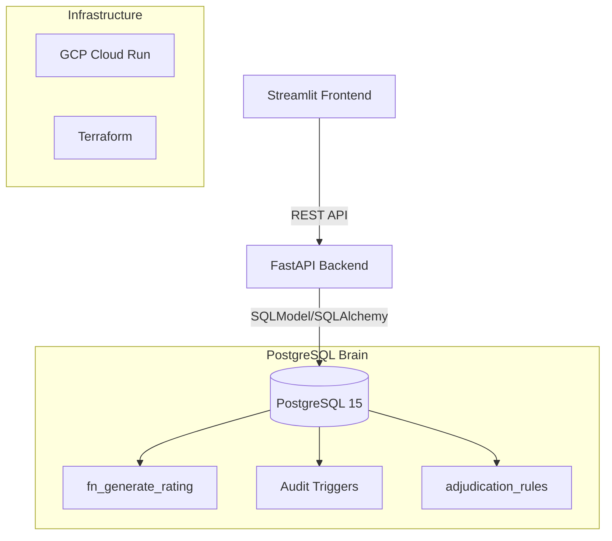

# IRB Credit Rating & Loan Decision Engine

[](https://credit-score-frontend-713116542425.us-central1.run.app/)
[](https://github.com/mbielicki/credit_score/actions)

An enterprise-grade corporate credit rating system for the Polish market. This project implements the **Mączyńska Model G (2006)** to predict bankruptcy probability (PD) for SMEs, using a **database-native approach** to business logic.

## 🚀 Key Technical Highlights

### 1. Database-Native Business Logic (PostgreSQL/PLpgSQL)
Instead of hard-coding risk rules in Python, the "brain" of the system resides in the database.
*   **Dynamic Z-Score Engine**: Uses a `JSONB` coefficient system in `fn_generate_rating()`, allowing risk models to be updated or swapped without a single line of code change.
*   **Automated Adjudication**: A prioritized rule engine (`adjudication_rules`) determines `APPROVED`, `REJECTED`, or `MANUAL_REVIEW` status based on rating class and requested loan amount.

### 2. Enterprise Auditing & Security
*   **Advanced Audit Trail**: A generic PL/pgSQL trigger captures `OLD` and `NEW` value diffs in `audit_logs`.
*   **Session Context Tracking**: The FastAPI layer injects the analyst's identity into the PostgreSQL session via `set_config('app.current_user', ...)`, ensuring every change is tied to a real user even with a shared connection pool.

### 3. Strict Type Integrity (FastAPI & SQLModel)
*   **Contract-First API**: Leveraging `SQLModel` (Pydantic + SQLAlchemy 2.0) for shared schemas between the database and the API.
*   **Robust Upserts**: Complex `on_conflict_do_update` patterns for handling financial statement revisions and company updates seamlessly.

## 🛠 Tech Stack
*   **Backend**: FastAPI, SQLModel (SQLAlchemy 2.0), Pydantic.
*   **Database**: PostgreSQL 15+ (Stored Procedures, Triggers, Views, JSONB).
*   **Frontend**: Streamlit (Analyst Dashboard).
*   **Infrastructure**: GCP (Cloud Run, Cloud SQL), Terraform, Docker Compose.
*   **Quality**: Pytest, Ruff (Linting), Mypy (Strict Typing).

## 🏗 Architecture


## 🚦 Verification & Quality
This project follows a strict **Verification Protocol** (defined in [GEMINI.md](./GEMINI.md)):
*   **Unit & Integration Tests**: `uv run pytest`
*   **Static Analysis**: `uv run ruff check`
*   **Type Checking**: `uv run mypy`

## 📦 Local Development

1. **Spin up the stack:**
   ```bash
   docker-compose up --build
   ```
2. **Access the tools:**
    *   **Dashboard**: `http://localhost:8501`
    *   **API Docs**: `http://localhost:8000/docs`
    *   **Database**: `localhost:5432`

---
*Note: This is a portfolio project using fictional, anonymized data for demo purposes.*

## 📄 License
This project is licensed under the **GNU General Public License v3.0**. See the [LICENSE](./LICENSE) file for the full text.
